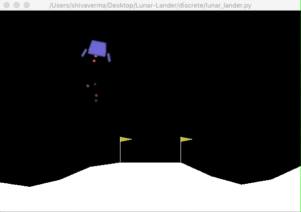

# Lab6-DQN-DDPG

- Deadline: 12/09 (Wed) 12:00 p.m.
- (No demo)

## Command usage
usage: dqn.py [-h] [--warmup WARMUP] [--episode EPISODE] [--capacity CAPACITY]
              [--batch_size BATCH_SIZE] [--lr LR] [--eps_decay EPS_DECAY]
              [--eps_min EPS_MIN] [--gamma GAMMA] [--freq FREQ]
              [--target_freq TARGET_FREQ] [--test_only] [--render]
              [--test_epsilon TEST_EPSILON] [-d DEVICE] [-m MODEL]
              [--logdir LOGDIR] [--seed SEED]

DLP DQN Lab

optional arguments:
  -h, --help            show this help message and exit
  --warmup WARMUP       number of warmup steps (default: 10000)
  --episode EPISODE     upper limit of training episodes (default: 1200)
  --capacity CAPACITY   capacity of replay buffer (default: 10000)
  --batch_size BATCH_SIZE
                        mini batch size extract from replay buffer (default:
                        128)
  --lr LR               learning rate (default: 0.0005)
  --eps_decay EPS_DECAY
                        epsilon decay rate (default: 0.995)
  --eps_min EPS_MIN     lower bound of epsilon (default: 0.01)
  --gamma GAMMA         gamma for update Q value (default: 0.99)
  --freq FREQ           interval to update behavior network (default: 4)
  --target_freq TARGET_FREQ
                        interval to update target network (default: 1000)
  --test_only           conduct test only runs (default: False)
  --render              render display (default: False)
  --test_epsilon TEST_EPSILON
                        test epsilon (default: 0.001)
  -d DEVICE, --device DEVICE
                        device used for training / testing (default: cuda)
  -m MODEL, --model MODEL
                        path to pretrained model / model save path (default:
                        models/dqn-2020-11-27-01-10-04.pth)
  --logdir LOGDIR       path to tensorboard log (default:
                        log/dqn/2020-11-27-01-10-04)
  --seed SEED           random seed (default: 2021111)

